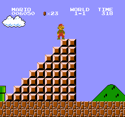

## deep-reinforcement-learning

Some experiments about reinforcement learning ,  the environment is mainly on CartPole

## Models

- [classical rl](https://github.com/shuangyangsc/deep-reinforcement-learning/tree/master/fake-code)
  - Dynamic Programming
  - Monte-Carlo
  - Temporal Difference

- [dqn](https://github.com/shuangyangsc/deep-reinforcement-learning/tree/master/dqn)
- [reinforce](https://github.com/shuangyangsc/deep-reinforcement-learning/tree/master/reinforce)
- [actor-critic](https://github.com/shuangyangsc/deep-reinforcement-learning/tree/master/actor-critic)

## Resource

- [books](http://web.mit.edu/dimitrib/www/RLbook.html)
- [deep-reinforcement-learning-papers](https://github.com/junhyukoh/deep-reinforcement-learning-papers)
- [awesome-rl](https://github.com/aikorea/awesome-rl)  $\star\star\star\star\star$   Many resources about rl

## FrameWork

- [openai/baseline](https://github.com/openai/baselines)

- [rlcode](https://github.com/rlcode/reinforcement-learning)

- [dopamine](https://github.com/google/dopamine)

## Plateforms

- [OpenAI gym](https://github.com/openai/gym) - A toolkit for developing and comparing reinforcement learning algorithms
- [OpenAI universe](https://github.com/openai/universe) - A software platform for measuring and training an AI's general intelligence across the world's supply of games, websites and other applications
- [DeepMind Lab](https://github.com/deepmind/lab) - A customisable 3D platform for agent-based AI research

- [torch-twrl](https://github.com/twitter/torch-twrl) - A package that enables reinforcement learning in Torch by Twitter
- [UETorch](https://github.com/facebook/UETorch) - A Torch plugin for Unreal Engine 4 by Facebook
- [TorchCraft](https://github.com/TorchCraft/TorchCraft) - Connecting Torch to StarCraft
- [rllab](https://github.com/openai/rllab) - A framework for developing and evaluating reinforcement learning algorithms, fully compatible with OpenAI Gym
- [TensorForce](https://github.com/reinforceio/tensorforce) - Practical deep reinforcement learning on TensorFlow with Gitter support and OpenAI Gym/Universe/DeepMind Lab integration.
- [OpenAI lab](https://github.com/kengz/openai_lab) - An experimentation system for Reinforcement Learning using OpenAI Gym, Tensorflow, and Keras.