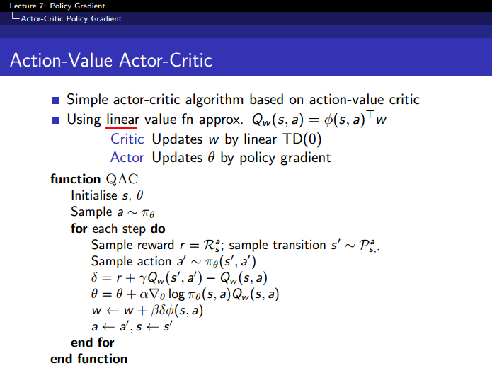

## Actor-Critic




```
actor: 输出动作
critic: 计算当前的 Q(s,a), 评价动作值的好坏
```


- 有点不是很稳定，其中有些地方还没调节好
- ./logs/model-save 下的 model 可用于控制 CartPole-v0 及 v1

- [reference](https://github.com/rlcode/reinforcement-learning/tree/master/2-cartpole/4-actor-critic)

