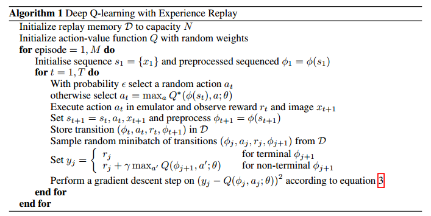

## Reinforce(Monte-Carlo Policy Gradient)




- [paper](https://www.cs.toronto.edu/~vmnih/docs/dqn.pdf)
- [reference](https://github.com/openai/baselines/tree/master/baselines/deepq)

​		

```
replay_buffer.py 来自 openai/baseline 里的code
也可以直接用 list 来代替
```

