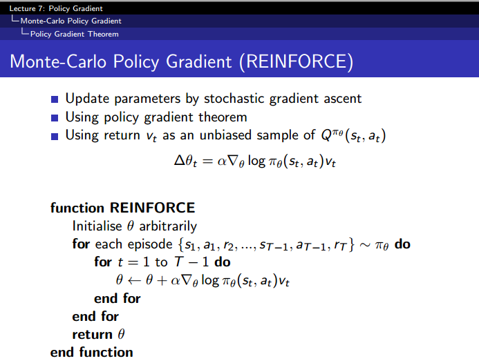

## Reinforce(Monte-Carlo Policy Gradient)

<div align=center> 
    


- run

  ```
  python main.py
  
  # line: 23~24
  # istrain: train or eval
  # perfomance_render: when eval, show the environment
  ```


- loss

  [reference](https://github.com/rlcode/reinforcement-learning/blob/master/2-cartpole/3-reinforce/cartpole_reinforce.py) 

  categorical cross entropy:
  
  <div align=center> H(p, q) = sum(p_i * log(q_i)) </div>
  
  take action - $a$ :
  
  <div align=center> p_a = value </div>
  
  <div align=center> q_a = policy(s, a) </div>
  
  then we get
  
  <div align=center> J_max = reward * log(pi_a) </div>
  
  which mean we should maximize the action what we have selected .

​		